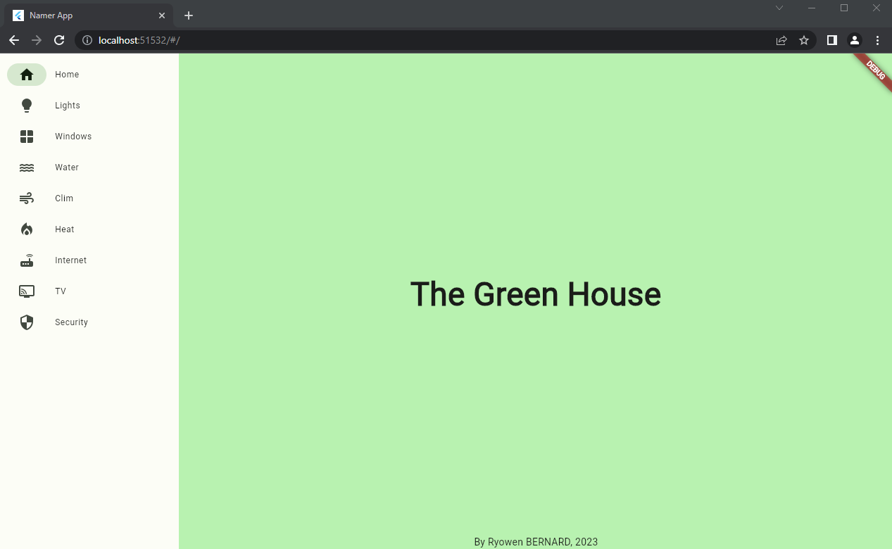
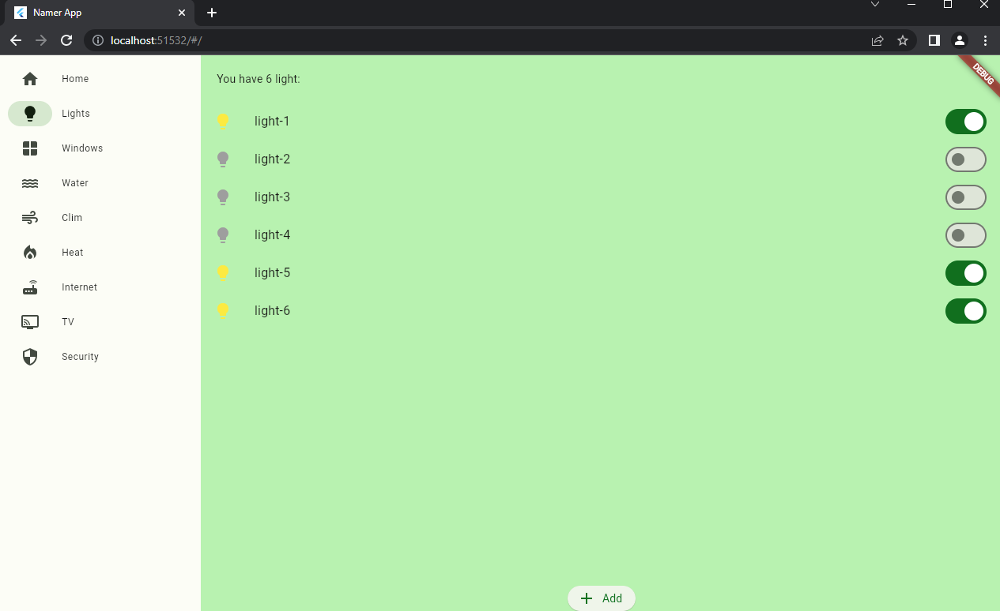
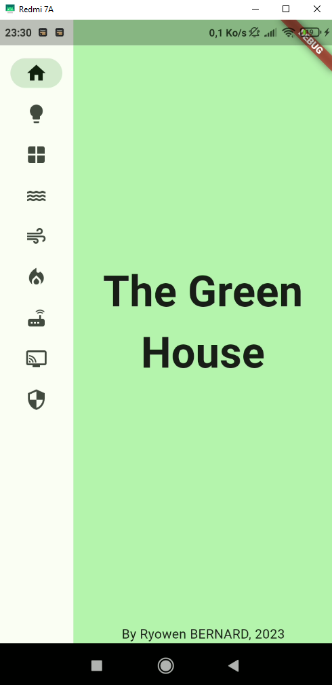
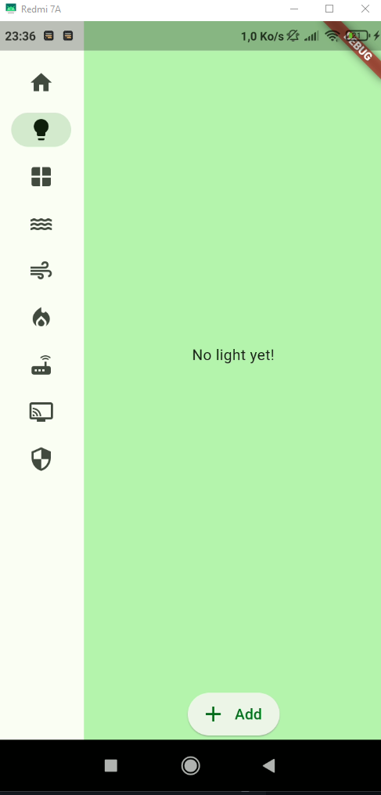

# Prototype GreenHouse Mobile app

GreenHouse est un projet de 1e STI2D, proposant une maison écologique et connectée. L'application mobile étant utilisé pour contrôler les appareils connectés.

L'application est développer en local entant que webapp Flutter.

L'application fonctionne sur Android (simulateur et smartphone)

C'est un prototype non connecté.

## Build

Le projet est écrit en Flutter/Dart.

Quelques ressources pour vous aidez à débuter si c'est votre 1e projet en Flutter/Dart :

- [Lab: Write your first Flutter app](https://docs.flutter.dev/get-started/codelab)
- [Cookbook: Useful Flutter samples](https://docs.flutter.dev/cookbook)

> For help getting started with Flutter development, view the
> [online documentation](https://docs.flutter.dev/), which offers tutorials,
> samples, guidance on mobile development, and a full API reference.
